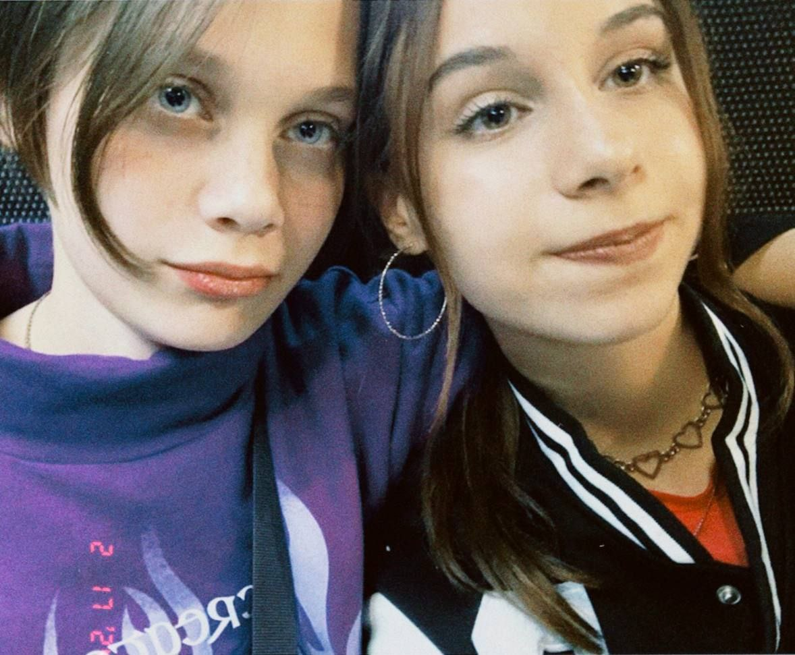
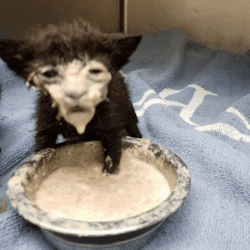

<!DOCTYPE html>
<html lang="en">
<head>
    <meta charset="UTF-8">
    <title>Sofis</title>
    <link rel="stylesheet" href="sofa.css">
</head>
<body>
    
    
софис я тебя очень сильно люблю,ты уменя самая красивая,самая добрая,самая любимая, я ради тебя готов на все, я каждый день о тебе думаю ,вспоминаю все моменты проведенные вместе.ты очень много для меня значишь, пожалуйста давай никогда не ссорится,я тебя оочень сильно люблю!   

    
    
Эта я без тебя

    
    
Эта ты без меня

    
    
Эта мы вместе

    
    
Эта наш сын

    
    
Я тебя очень люблю.

    
Егорыч and Владыч продакшан от слова ашан  

</body>

</html>
